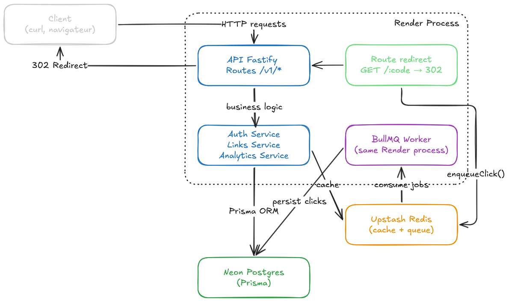

<div align="center">

# LinkForge

URL shortener API with authentication, API keys, anonymized async click tracking and analytics.

[](https://github.com/Yentec/LinkForge/actions)


**[Live demo](https://linkforge-538y.onrender.com/health)** · **[API reference](https://linkforge-538y.onrender.com/docs/)** · **[Architecture](docs/architecture.md)**

</div>

> ⚠️ The demo runs on a free Render instance and sleeps after 15 min of inactivity.
> The first request after sleep may take 30-60 s. Subsequent requests are fast.

Demo account: `demo@linkforge.dev` / `DemoUser2026!`

---

## Features

- **Authentication.** Email + password with Argon2id, JWT access tokens (15 min) and rotating opaque refresh tokens.
- **API keys** with `read` / `write` scopes, returned in clear once, stored hashed.
- **Short links** with auto-generated codes or custom slugs, soft delete, expiry, idempotent creation (`Idempotency-Key`), cursor pagination.
- **Public redirect** with Redis-cached lookup (TTL 5 min) and async click tracking off the hot path.
- **Click analytics** — totals, time series (day/week), top countries / referrers / devices / browsers — aggregated in SQL.
- **OpenAPI** derived from Zod schemas, served as a JSON document and an interactive [Scalar](https://scalar.com) reference.
- **GDPR-friendly tracking.** IPs are never stored: only a salted, truncated SHA-256 hash.
- **Anti-SSRF.** Targets pointing to localhost or RFC1918 ranges are rejected at creation.

## Tech stack

Node.js 22 · TypeScript (strict) · Fastify 5 · Prisma 7 · PostgreSQL 16 · Redis 7 · BullMQ · Zod 4 · Pino · Vitest · Testcontainers

## Architecture



Single Node process, layered modules, in-process BullMQ worker. State on Neon (Postgres) and Upstash (Redis). Full details in [`docs/architecture.md`](docs/architecture.md).

## Performance

Redirect hot-path benchmark (`GET /:code`, cache warm, 100 VUs, ~60 s).
Run locally against Docker Compose to avoid the production rate limit.

| Metric | Local (Docker Compose) |
|--------|------------------------|
| p50    | 45 ms                  |
| p95    | 88 ms                  |
| p99    | 103 ms                 |
| req/s  | ~1 530                 |

```bash
# Prerequisites: docker compose up -d && npm run dev && npm run db:seed

# Via Docker (no local k6 install needed):
docker run -i grafana/k6 run -e BASE_URL=http://host.docker.internal:3000 - < tests/load/redirect.js

# With k6 installed locally:
k6 run tests/load/redirect.js

# Against production (warm up first — Render free tier sleeps after 15 min):
docker run -i grafana/k6 run -e BASE_URL=https://linkforge-538y.onrender.com - < tests/load/redirect.js
```

> The production instance rate-limits at 100 req/min per IP — throughput figures from a single-machine run reflect this safeguard, not raw server capacity. See [ADR 0007](docs/adr/0007-redirect-latency-baseline.md) for context.

## Quickstart

```bash
git clone https://github.com/Yentec/LinkForge.git
cd linkforge
npm install
cp .env.example .env       # then edit secrets
docker compose up -d        # postgres + redis
npm run db:migrate
npm run dev                 # http://localhost:3000
```

Open `http://localhost:3000/docs` for the interactive reference.

## Try the API

```bash
BASE=http://localhost:3000

# 1. Register and capture the access token
TOKEN=$(curl -s -X POST $BASE/v1/auth/register \
  -H 'content-type: application/json' \
  -d '{"email":"you@example.com","password":"SuperSecret123"}' | jq -r .accessToken)

# 2. Create a short link (with idempotency)
curl -s -X POST $BASE/v1/links \
  -H "authorization: Bearer $TOKEN" \
  -H 'content-type: application/json' \
  -H 'idempotency-key: my-first-link' \
  -d '{"target":"https://example.com/article"}' | jq

# 3. Follow the redirect (and trigger an async click)
curl -sI $BASE/<code>

# 4. Read the stats
curl -s -H "authorization: Bearer $TOKEN" \
  "$BASE/v1/links/<id>/stats?interval=day" | jq
```

## Project structure

```
src/
├── config/            env validation (Zod), Pino logger
├── modules/
│   ├── auth/          register, login, refresh, logout, me
│   ├── api-keys/      key management, scopes
│   ├── links/         CRUD, idempotency, cursor pagination, anti-SSRF
│   ├── redirect/      public GET /:code, cache + async enqueue
│   ├── tracking/      BullMQ queue, worker, click processor
│   ├── analytics/     SQL aggregations, cached stats
│   ├── docs/          OpenAPI document and Scalar mount
│   ├── health/        liveness, readiness
│   └── maintenance/   cleanup cron job
├── shared/
│   ├── auth/          password hashing, JWT, opaque tokens
│   ├── cache/         Redis connection, JSON cache service
│   ├── errors/        typed AppError, global handler
│   ├── middleware/    authenticate, idempotency
│   ├── queue/         BullMQ connection factory
│   ├── geo/           pluggable country resolver
│   └── utils/         short-code, UA classifier, anti-SSRF url validator
├── docs/openapi.ts    OpenAPI document built from Zod schemas
├── app.ts             Fastify factory (testable, no listen)
└── server.ts          entrypoint + graceful shutdown + worker lifecycle
prisma/
├── schema.prisma
├── migrations/
└── seed.ts            demo account + ~600 weighted clicks
tests/
├── integration/       end-to-end via Fastify inject + real Postgres (testcontainers)
├── unit/              URL safety, UA classifier
└── helpers/           test app builder, DB reset
docs/
├── architecture.md    + images/
└── adr/               architecture decision records
```

## Testing

```bash
npm test               # full suite (Testcontainers spins up a throwaway Postgres)
npm run test:cov       # with coverage
```

Integration tests run against a real Postgres (via Testcontainers) and a real Redis (via the Docker service in CI). Prisma migrations are applied to the test database, exercising the migration path on every CI run.

## Deployment

The live demo runs on **Render** (Docker), with **Neon** for Postgres and **Upstash** for Redis. Infrastructure is declared in [`render.yaml`](render.yaml). Migrations are applied on every container start by [`scripts/start.sh`](scripts/start.sh).

## Decisions and trade-offs

A few choices that aren't obvious from the code:

- **Modular monolith over microservices.** One process, one deploy, one log stream. The worker can be extracted later without rewriting the modules. ([ADR 0001](docs/adr/0001-modular-monolith.md))
- **Opaque refresh tokens, not JWT.** Revocation requires a DB lookup anyway, so a self-contained JWT adds no value. ([ADR 0002](docs/adr/0002-opaque-refresh-tokens.md))
- **Zod 4 as single source of truth.** Validation, static types and the OpenAPI document all come from the same schemas via `z.toJSONSchema()`. ([ADR 0003](docs/adr/0003-zod-as-source-of-truth.md))
- **In-house UA classifier** to avoid `ua-parser-js` v2+ AGPL licensing. ([ADR 0004](docs/adr/0004-no-ua-parser-js.md))
- **Asynchronous click tracking** keeps redirect latency bounded by the cache, regardless of DB or geo-resolver issues. ([ADR 0005](docs/adr/0005-async-click-tracking.md))
- **Refresh-token reuse detection** via chain revocation: replaying a used token revokes the entire session. ([ADR 0006](docs/adr/0006-refresh-token-reuse-detection.md))
- **Redirect latency baseline** measured with k6 to confirm the async-tracking architectural bet. ([ADR 0007](docs/adr/0007-redirect-latency-baseline.md))

## Roadmap

Not implemented, deliberately:

- Webhook on click events, signed with HMAC-SHA256.
- Real GeoIP via MaxMind GeoLite2, behind an env flag.
- Workspaces / team accounts.

## License

MIT
